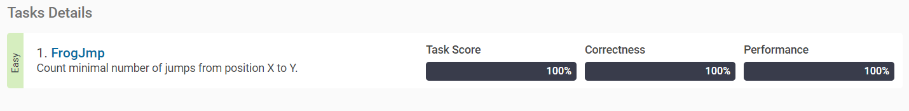

Frog Jump
-----------------------
<https://app.codility.com/programmers/lessons/3-time_complexity/frog_jmp/>

문제
-------------------------
> Count minimal number of jumps from position X to Y.

A small frog wants to get to the other side of the road. The frog is currently located at position X and wants to get to a position greater than or equal to Y. The small frog always jumps a fixed distance, D.

Count the minimal number of jumps that the small frog must perform to reach its target.

Write a function:

def solution(X, Y, D)

that, given three integers X, Y and D, returns the minimal number of jumps from position X to a position equal to or greater than Y.

For example, given:
```
  X = 10
  Y = 85
  D = 30
```
the function should return 3, because the frog will be positioned as follows:

after the first jump, at position 10 + 30 = 40
after the second jump, at position 10 + 30 + 30 = 70
after the third jump, at position 10 + 30 + 30 + 30 = 100
Write an efficient algorithm for the following assumptions:

X, Y and D are integers within the range [1..1,000,000,000];
X ≤ Y.


풀이
--------------

<https://codility.com/media/train/1-TimeComplexity.pdf>

### 반올림

파이썬에서 숫자는 올림, 내림, 반올림이 가능하다.
반올림은 파이썬의 내장 함수인 round를 사용해서 할 수 있다.
round(실수, n) 을 사용하면 소수점 n번째 자리까지 표현하여 반올림한다. n을 음수를 입력하면 정수자리에 해당하는 부분까지 반올림이 가능하다.

```python
#반올림
round(3.141592)
# >> 3
round(3.141592, 1)
# >> 3.1
round(3.141592, 3)
# >> 3.142
round(3141592, -3)
# >> 3142000
```


### 올림, 내림

올림과 내림은 math 모듈 안에 ceil, floor, trunc 함수를 사용하여 가능하다.

```python
import math

#올림
math.ceil(2.5)
# >> 3

#내림
math.floor(2.5)
# >> 2
math.trunc(2.5)
# >> 2
```


답
--------------

``` python
# solution
def solution(X,Y,D):
    import math
    out = math.ceil((Y-X)/D)
    return(out)

X = 10
Y = 85
D = 30
solution(X,Y,D)
# >> 3
```

테스트 결과
--------------

