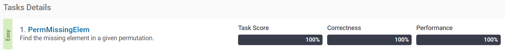
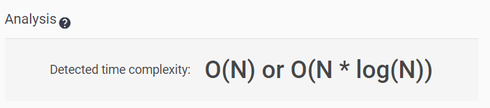

[Frog Jump](https://app.codility.com/programmers/lessons/3-time_complexity/perm_missing_elem/)
-------------------------
> Find the missing element in a given permutation.


풀이
--------------

list에서 조건에 맞는 원소를 filtering하는 방법은 크게 2가지인데, 조건에 맞는 원소만 바로 추출하는 것과, 조건에 맞는 원소의 index를 추출하여 filtering하는 것이 있다.


### 1. filter
lambda를 사용하여 함수를 정의한 후 filter를 사용하여 list를 생성하는 방법이다.

```python
my_list = [1,2,3,4,5,6,7,8,9,10]
list(filter(lambda x : x > 3, my_list))
# >> [4, 5, 6, 7, 8, 9, 10]
```


### 2. list comprehension
filter보다 가독성이 뛰어나 더 많이 사용하는 방법이다.

```python
[x for x in my_list if x > 3 ]
# >> [4, 5, 6, 7, 8, 9, 10]
```

### 3. numpy where
numpy의 where를 array에서 조건에 맞는 원소의 index를 찾을 수 있다.

```python
import numpy as np

a = np.array([1, 4, 3, 2, 5, 6])
a
idx = np.where(a > 3)[0]
idx
a[idx]
```

### 4. index 추출

```Python
a = [1,2,3,4,5]
[i for i in range(len(a)) if a[i] > 2]
```


답
--------------

``` python
def solution(A) :
    # empty_and_single
    if len(A) == 0 :
        answer = 1
    else :
        Asort = sorted(A)
        check = [i+1 == Asort[i] for i in range(len(Asort))]
        # missing_first_or_last
        idx = min([i for i in range(len(check)) if check[i] == 0], default=len(A))
        answer = idx+1
    return(answer)


#empty_and_single
A = []
solution(A)

A = [2,3]
solution(A)

A = [1,2,3]
solution(A)
```

테스트 결과
--------------



