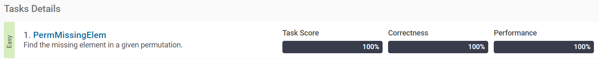
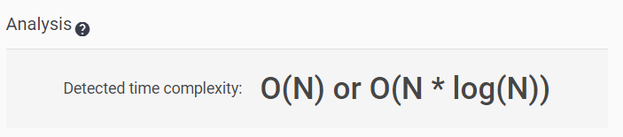
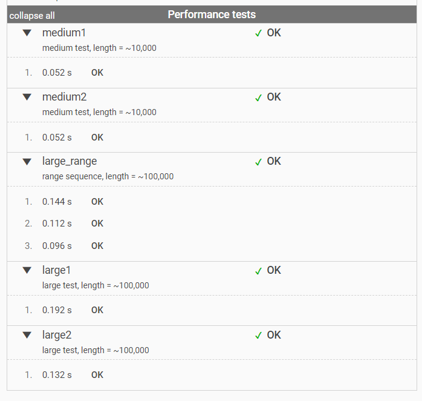
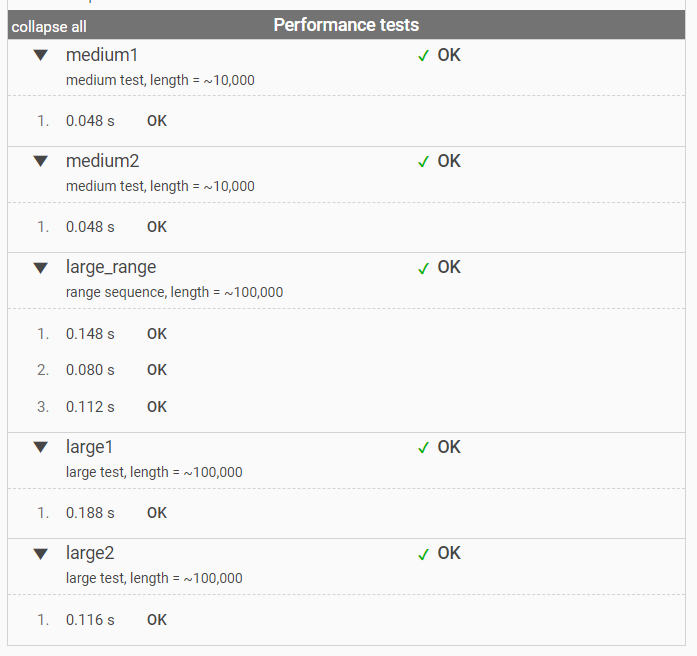

[PermMissingElem](https://app.codility.com/programmers/lessons/3-time_complexity/perm_missing_elem/)
-------------------------
> Find the missing element in a given permutation.


풀이
--------------

이번 문제를 간단히 설명하자면, 리스트에 없는 원소를 찾는 것이다.
길이 n의 리스트에는 1~(n+1)까지의 원소를 가지며, 단 1개의 원소가 빠져있다.
예를 들면 A=[1, 3, 4]이면 2를 반환하는 함수를 만드는 것이다.

2가지 방식으로 문제를 접근하여 결과를 비교하였다.

* 1번째 방법 : 리스트를 정렬한 후, 순서대로 값을 가지고 있는 리스트와 비교하여 빠진 원소를 filtering하는 방법
* 2번째 방법 : 리스트를 정렬한 후, 순차적으로 값을 하나씩 비교하여 빠진 원소를 찾는 방법


### <1번째 Solution>

먼저 list에서 list에서 조건에 맞는 원소를 filtering하는 방법에 대해 알아보았다. 조건에 맞는 원소만 바로 추출하는 것과, 조건에 맞는 원소의 index를 추출하여 filtering하는 것이 있다.


### 1. filter
lambda를 사용하여 함수를 정의한 후 filter를 사용하여 list를 생성하는 방법이다.

```python
my_list = [-3, -2, -1, 0, 1, 2, 3]
list(filter(lambda x : x > 0, my_list))  # my_list에서 양수만 filtering
# >> [1, 2, 3]
```


### 2. list comprehension
filter보다 가독성이 뛰어나 더 많이 사용하는 방법이며, 개인적으로 더 선호하는 방법이다.

```python
[x for x in my_list if x > 0] # my_list에서 양수만 filtering
# >> [1, 2, 3]
```


### 3. numpy where
numpy의 array에서 조건에 맞는 원소의 index를 찾을 수 있다. 이는 1차원 뿐만 아니라 2차원, 3차원의 데이터프레임에서도 index를 찾을 수 있다. 따라서 pandas, numpy로 데이터프레임을 다루고 parameter를 tuning하는 데이터분석가들이 즐겨 쓰는 방법이다.

```python
import numpy as np

a = np.array([-3, -2, -1, 0, 1, 2, 3])
idx = np.where(a > 0)[0]  # a array에서 양수인 index
idx
# >> array([4, 5, 6], dtype=int64)
a[idx]
# >> array([1, 2, 3])
```

### 4. list comprehension을 이용한 index 추출
list comprehension을 이용하여 조건을 바꾸어주면 동일하게 index를 반환할 수 있다.

```Python
my_list = [-3, -2, -1, 0, 1, 2, 3]
[i for i in range(len(my_list)) if my_list[i] > 0]
# >> [4, 5, 6]
```


filtering을 이용하여 짠 코드는 아래와 같다.
Asort = [1, 2, 3, 5, 6]와 [1, 2, 3, 4, 5]를 비교한다.
check = [True, True, True, False, False] 가 나오면
False가 처음으로 나오는 부분을 빠진 원소로 보았다.

또한 empty list일때는 1을 반환해야하는 것을 유의해야한다.


답
--------------

``` python
def solution(A) :
    # empty_and_single
    if len(A) == 0 :
        answer = 1
    else :
        Asort = sorted(A)
        check = [i+1 == Asort[i] for i in range(len(Asort))]
        # missing_first_or_last
        idx = min([i for i in range(len(check)) if check[i] == 0], default=len(A))
        answer = idx+1
    return(answer)
```


### <2번째 Solution>

모든 원소를 filtering하기 보다는, while문을 사용하여 중간에 빠진 원소를 찾으면 멈추는 방식으로 time complexity를 줄이고자 하였다.

정렬한 리스트인 Asort의 값을 순서대로 비교한다. Asort[0] == 1, Asort[1] == 2, ... 으로 순차적으로 비교하면서 다른 값이 나오면 while문을 종료하여 time complexity를 절감하려 하였다. 결과 비교는 아래에 있다.


답
--------------

```Python
def solution(A) :
    # empty_and_single
    if len(A) == 0 :
        return(1)
    else :
        i = 0
        Asort = sorted(A)
        while i < len(Asort):
            if Asort[i] != i+1 :
                break
            i += 1
        return(i+1)
```

테스트 결과
--------------

### Solution1의 Performance 결과





### Solution2의 Performance 결과




> 비교한 결과 while문을 사용하여 break한 Solution2의 Performane가 특히 large test에서 좋은 성능을 낸다고 볼 수 있다.
