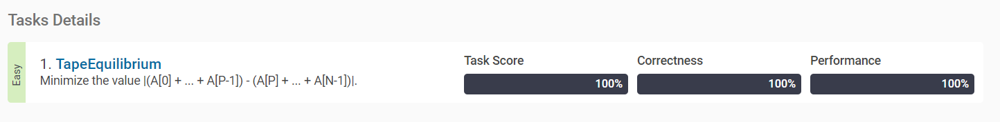

[PTapeEquilibrium](https://app.codility.com/programmers/lessons/3-time_complexity/tape_equilibrium/start/)
-------------------------
> Minimize the value |(A[0] + ... + A[P-1]) - (A[P] + ... + A[N-1])|.

풀이
--------------

이번 문제는, 각각의 포인트에서 리스트를 쪼개서 왼쪽의 합과 오른쪽의 합의 차가 가장 작은 값을 반환하는 것이다.
예를 들어 A=[3, 1, 2, 4, 3]이면


```
[3] / [1, 2, 4, 3] => |3 - 10| = 7
[3, 1] / [2, 4, 3] => |4 - 9| = 3
[3, 1, 2] / [4, 3] => |6 - 7| = 1
[3, 1, 2, 4] / [3] => |10 - 3| = 7
```
따라서 1을 반환하면 된다.

```
[3] / [1, 2, 4, 3] => 3 / 10
[3, 1] / [2, 4, 3] => 3 + 1 / 10 - 1
```

위 예제를 보면, 포인트를 옮길 때마다 왼편에는 새로운 원소를 더하고, 오른편에는 그 원소를 빼면 간단하게 해결된다. 이를 구현하면 아래 답과 같다.


답
--------------

``` python
def solution(A) :
    left = 0
    right = sum(A)
    diff = []
    for i in A[:-1]:
        left += i
        right -= i
        diff.append(abs(left - right))
    return(min(diff))

```


테스트 결과
--------------

